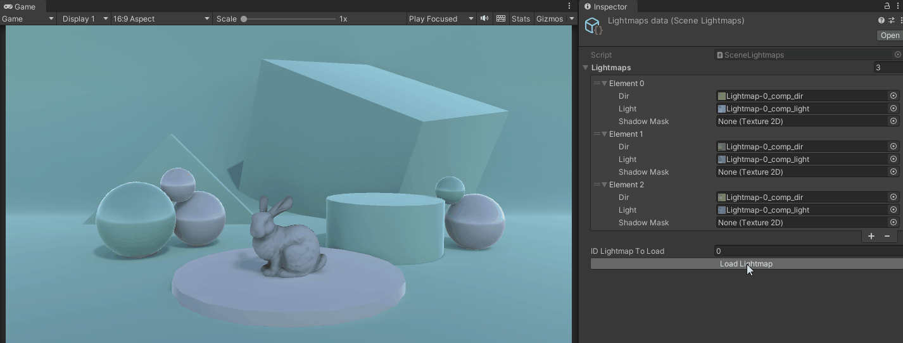

# Change Lightmaps references on demand
Tool that allows changing a scene lightmap reference on demand.

###### Current support: Unity 2021.3.8f1

**Usage of the project**
* Clone the repository or download the zip to use this project locally.
* Load the project using Unity 2021.3.8f1 or superior.
* Bake your lightmaps (rename them if necessary), and make a copy of them into another folder (in this project, I created a folder named: _Lightmaps_).
* Create an _SceneLightmaps_ scriptable object in the context menu: **Create/Tools/Lightmaps helper**
* Add the lightmaps textures to the lightmaps list of your recently created scriptable object.
* Change the lightmap reference of your scene, by modifying the value of the **ID Lightmap To Load**.

# How it works?
Below is attached a .gif that shows how this tool works.

## Example:

Files to take into account for achieving this:
 * C# file(s): [SceneLightmaps.cs](Assets/Scripts/SceneLightmaps.cs) (Scriptable object), [SceneLightmapsEditor.cs](Assets/Editor/SceneLightmapsEditor.cs) (Custom editor)
 * Texture(s): Lightmaps located at: *Assets/Lightmaps/Ligthmap_{id}*

 # Resources
 * [Stanford Bunny PBR](https://skfb.ly/otyHx) by hackmans.